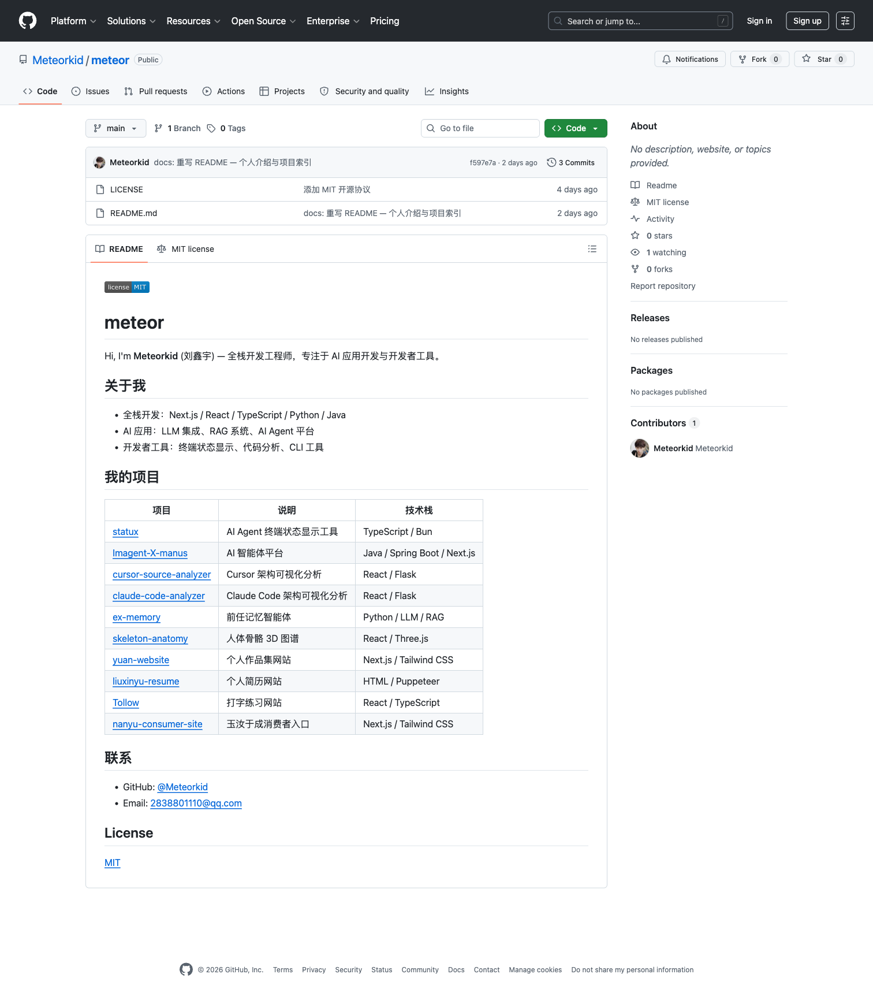

# meteor

Hi, I'm **Meteorkid** (刘鑫宇) — 全栈开发工程师，专注于 AI 应用开发与开发者工具。

## 关于我

- 全栈开发：Next.js / React / TypeScript / Python / Java
- AI 应用：LLM 集成、RAG 系统、AI Agent 平台
- 开发者工具：终端状态显示、代码分析、CLI 工具

## 我的项目

| 项目 | 说明 | 技术栈 |
|------|------|--------|
| [statux](https://github.com/Meteorkid/statux) | AI Agent 终端状态显示工具 | TypeScript / Bun |
| [Imagent-X-manus](https://github.com/Meteorkid/Imagent-X-manus) | AI 智能体平台 | Java / Spring Boot / Next.js |
| [cursor-source-analyzer](https://github.com/Meteorkid/cursor-source-analyzer) | Cursor 架构可视化分析 | React / Flask |
| [claude-code-analyzer](https://github.com/Meteorkid/claude-code-analyzer) | Claude Code 架构可视化分析 | React / Flask |
| [ex-memory](https://github.com/Meteorkid/ex-memory) | 前任记忆智能体 | Python / LLM / RAG |
| [skeleton-anatomy](https://github.com/Meteorkid/skeleton-anatomy) | 人体骨骼 3D 图谱 | React / Three.js |
| [yuan-website](https://github.com/Meteorkid/yuan-website) | 个人作品集网站 | Next.js / Tailwind CSS |
| [liuxinyu-resume](https://github.com/Meteorkid/liuxinyu-resume) | 个人简历网站 | HTML / Puppeteer |
| [Tollow](https://github.com/Meteorkid/Tollow) | 打字练习网站 | React / TypeScript |
| [nanyu-consumer-site](https://github.com/Meteorkid/nanyu-consumer-site) | 玉汝于成消费者入口 | Next.js / Tailwind CSS |

## 截图

### GitHub Profile 首页

## 联系

- GitHub: [@Meteorkid](https://github.com/Meteorkid)
- Email: 2838801110@qq.com

## License

[MIT](LICENSE)
